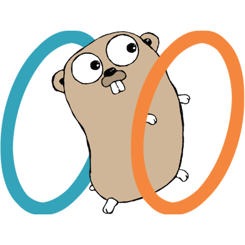

# gopolar



TCP port forwarding tool with both TUI and web UI support.

> The [gopher image](https://go.dev/blog/gopher) is [Creative Commons Attribution 4.0](https://creativecommons.org/licenses/by/4.0/) licensed, credit to Renee French.

# Install

Simply `go install github.com/goverclock/gopolar/cmd/...@latest` would install gopolar core & TUI, which is enough for basic usage.

The web UI has to be built with [ install.sh ](./install.sh). [ Vite ](https://vitejs.dev/) is required to build the UI.

# Usage

### Basic

After install, run `gpcore` to start gopolar core process. In another window run `gptui` to start TUI and interact with the core.

If the web UI is installed, visit `localhost:7070` in a browser. The web UI offers same functionality with TUI.

With the web UI/TUI, you can create, edit, toggle and delete tunnels and inspect their status.

> You may want to [ create a system service ](https://medium.com/@benmorel/creating-a-linux-service-with-systemd-611b5c8b91d6)for gpcore if you are using systemd.

### Saved Tunnels

gopolar saves tunnels in `~/.config/gopolar/gopolar.toml`.

### Logs

**On each startup, gopolar deletes all previous logs.** Copy them to another directory if you want to persist them.

gopolar saves logs in `~/.config/gopolar/logs/[tunnel source]-[tunnel dest]/`, containing raw data sent and received for each connection in that tunnel. You may want to read them with a hex reader like `xxd`.

# RESTful API

You can also integrate gopolar easily with its RESTful API.

### Types

```
type Tunnel struct {
    id      uint64
    name    string
    enable  bool
    source  string  // always localhost:xxxx
    dest    string  // e.g. 192.168.10.1:7878
}
```

### Response

```
{
    success: true/false,
    err_msg: "error message",
    data: {...},
}
```

### API

**GET /tunnels/list**

Get all tunnels from core, sorted by tunnel ID.

```
response("data"):
{
    tunnels []Tunnels
}
```

**POST /tunnels/create**

Create a new tunnel.

```
body:
{
    name    string
    source  string
    dest    string
}
response("data"):
{
    id      uint64
}
```

**POST /tunnels/edit/:id**

Edit tunnel with ID.

```
body:
{
    name    string
    source  string
    dest    string
}
```

**POST /tunnels/toggle/:id**

Enable/disable tunnel with ID.

**DELETE /tunnels/delete/:id**

Delete tunnel with ID.

**GET /about**

Information about gopolar.

```
response("data"):
{
    version string  // e.g. 1.0.0
}
```
