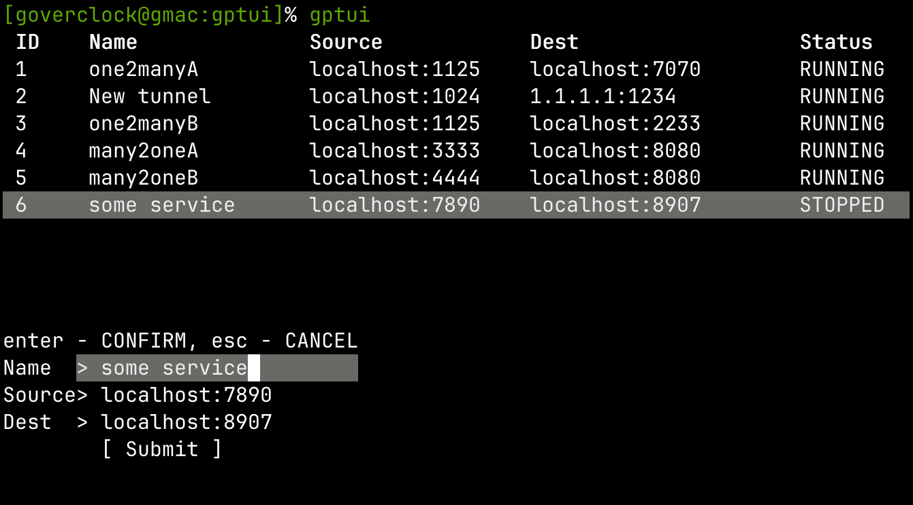
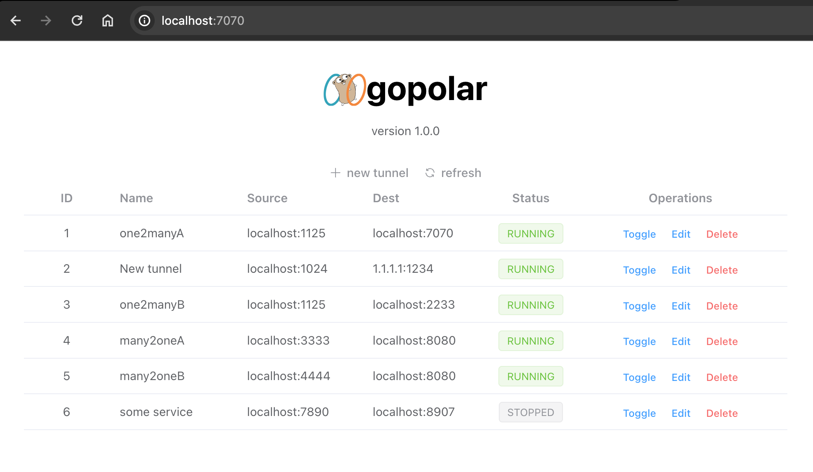

# gopolar

TCP port forwarding tool with both TUI and web UI support.

> The [gopher image](https://go.dev/blog/gopher) is [Creative Commons Attribution 4.0](https://creativecommons.org/licenses/by/4.0/) licensed, credit to Renee French.

# Install

Simply `go install github.com/goverclock/gopolar/cmd/...@latest` would install gopolar core & TUI, which is enough for basic usage.

The web UI has to be built with [ install.sh ](./install.sh). [ Vite ](https://vitejs.dev/) is required to build the UI.

# Usage

### Basic

After install, run `gpcore` to start gopolar core process. In another window run `gptui` to start TUI and interact with the core.

If the web UI is installed, visit `localhost:7070` in a browser. The web UI offers same functionality with TUI.

With the web UI/TUI, you can create, edit, toggle and delete tunnels and inspect their status.

> You may want to [ create a system service ](https://medium.com/@benmorel/creating-a-linux-service-with-systemd-611b5c8b91d6)for gpcore if you are using systemd.

### Saved Tunnels

gopolar saves tunnels in `~/.gopolar/tunnels.toml`, and restore them after `gpcore` starts. If you want to ignore them, run `gpcore` with `-nosave` flag.

### Logs

**On startup, gopolar deletes all previous logs.** Copy them to another directory if you want to persist them.

gopolar does not do logging by default in consideration of performance. Run `gpcore` with `-log` flag to enable logging.

Logs are saved at `~/.gopolar/logs/[tunnel source]-[tunnel dest]/[connection establish time]-[send | recv]`, containing raw data sent and received for each connection in that tunnel. You may want to read them with a hex reader like `xxd` e.g. `cat logs/\[::\]:2222-localhost:7070/2024-02-18\ 09:54:10.727005-send | xxd`.

# RESTful API

You can also integrate gopolar easily with its RESTful API. Check out [API.md](./API.md).

# Screenshots

TUI:

Web UI:

